# 演示脚本 — 按客户需求表逐步骤演示（华信案例）

> 分支 `demo/psa-presales` · 需求来源 `CRM____.xlsx` Sheet1（40 步 / 9 个业务环节）· 总纲 [#2](https://github.com/sunhaolin/hotcrm/issues/2) · 需求记录 REQ-0002（PR #1）
>
> 每一节对应需求表的一个业务环节，每一行对应表中的一个步骤序号；截图文件以 `S{步骤序号}-…` 命名，放在本目录。全程约 42 分钟，两处系统拦截是高潮，放在步骤 8 和步骤 36。

## 0. 演示准备

- **重置并启动**：`git checkout demo/psa-presales && pnpm install && pnpm demo:reset && pnpm dev`（端口 4001；首启回放 40 条中文种子，等日志安静约 20–30 秒）。
- **演示人员**：`node scripts/demo-psa-staff.mjs` — 创建 6 名中文同事（张伟 客户经理 / 李娜 解决方案经理·资源报价 / 王强 交付经理·项目经理 / 赵敏 项目总监 / 刘洋 QA / 陈晨 分包 TS），并填入铁三角、项目角色、工时填报人。
- **登录与语言**：浏览器打开 `http://localhost:4001/_console/login`，登录 admin@objectos.ai / admin123；浏览器语言设为简体中文，主页「我的应用」点 HotCRM。
- **自检 2 分钟**：交付项目列表：DLV-0002 预算消耗 132、DLV-0001 约 53；项目成本仪表板四块磁贴有数；待我审批为空；三条"现场提交"的记录处于草稿：客户「东方联合银行」、线索「张建国」、商机「东方联合银行信贷风控平台」（立项状态 未立项）。
- **不要点的地方**：设置 → 系统设置里的元数据校验 / 文档一致性守卫（本分支刻意不过 `pnpm verify`）；语言不要切到西班牙语 / 日语（新对象只做了中文和英文）。

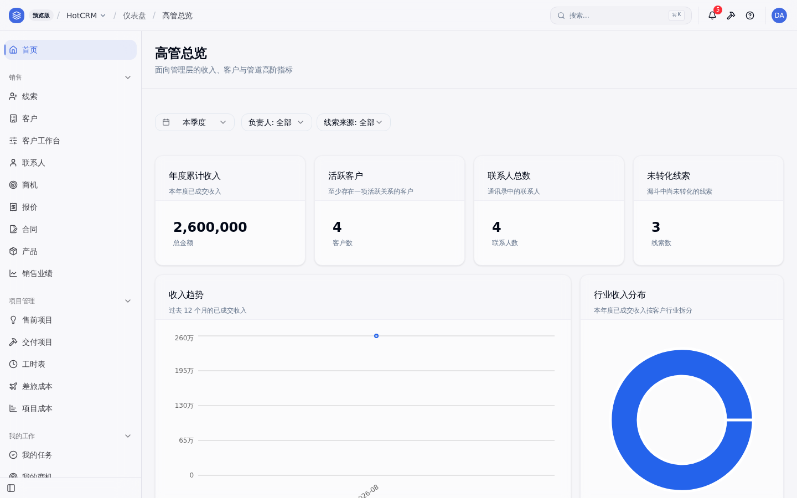
*S00-进入应用 — 进入应用：首页是标准的高管总览，左侧「销售」与新的「项目管理」两组导航*

状态图例：**新增** 全新开发 · **扩展** 已有对象加字段 · **复用** 标准功能，零开发 · **部分** 主体可演示，有缺项 · **简化** 做了，比客户要求简 · **未做** 不演示，只讲口径

## 演示总览

| 节 | 业务环节 | Excel 步骤 | 系统 | 时长 | 截图 |
|---|---|---|---|---|---|
| 1 | 客户管理 | 1–5 | CRM | 5 分钟 | 7 张 |
| 2 | 线索管理 | 6–7 | CRM | 3 分钟 | 5 张 |
| 3 | 商机立项 | 8–11 | CRM | 8 分钟 | 12 张 |
| 4 | 商机跟进 | 12–14 | CRM | 4 分钟 | 5 张 |
| 5 | 售前项目立项 | 15–20 | 项管平台 | 5 分钟 | 6 张 |
| 6 | 交付项目立项 | 21–26 | 项管平台 | 4 分钟 | 7 张 |
| 7 | 成本计划管理 | 27–32 | 项管平台 | 4 分钟 | 3 张 |
| 8 | 成本执行管理 | 33–36 | 项管平台 | 6 分钟 | 9 张 |
| 9 | 项目报表管理 | 37–40 | 项管平台 | 3 分钟 | 3 张 |
| | 合计 | 1–40 | | 42 分钟 | 58 张 |

## 1. 客户管理（Excel 步骤 1–5 · 5 分钟）

一个客户从录入到审批生效。招标代理类客户在这里就被分类，后面的商机门禁靠它。

### 步骤 1 · 新增客户基本信息录入

- **需求表系统路径**：`CRM→客户管理→新增客户` · **状态**：扩展
- **点哪里**：销售 → 客户 → 打开「华信科技有限公司」。
- **看什么 · 怎么讲**：客户编码 ACC-000001 自动分配；「基本信息」里看客户分类 = 常规销售客户、客户简称、统一社会信用代码；行业、员工人数、年营收是标准字段。列表里另一条「中招国际招标代理有限公司」客户分类 = 招标代理公司——留到步骤 8 演示拦截。
- **口径**：未做：组织层级、注册信息以现有字段（上级客户、描述）承载。

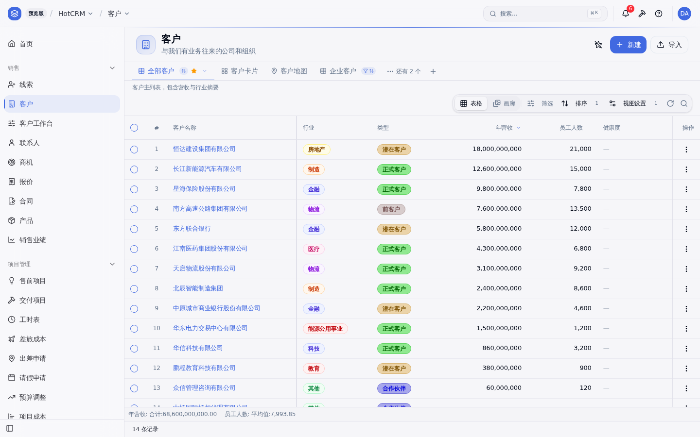
*S01-客户列表 — 客户列表：四家中文客户*

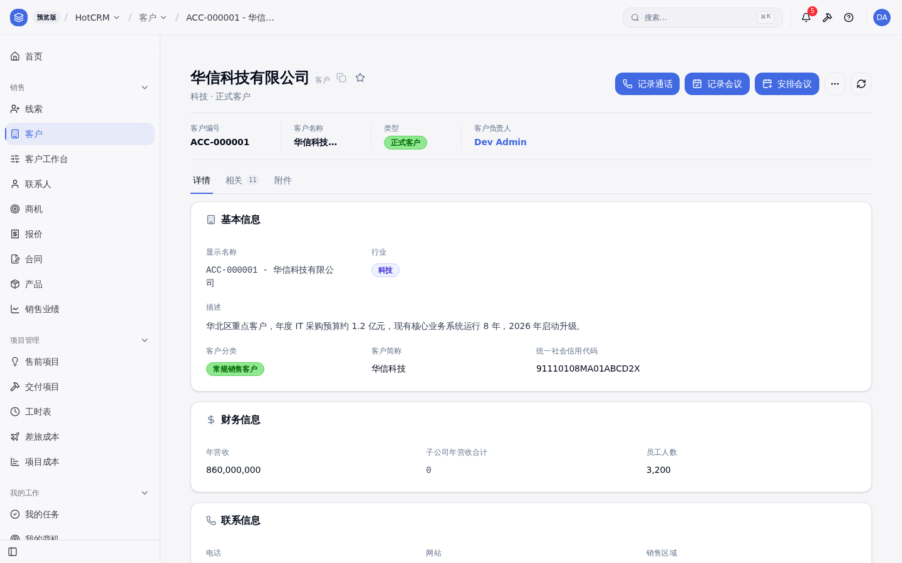
*S01b-客户详情-基本信息 — 客户详情：客户分类 / 简称 / 统一社会信用代码*

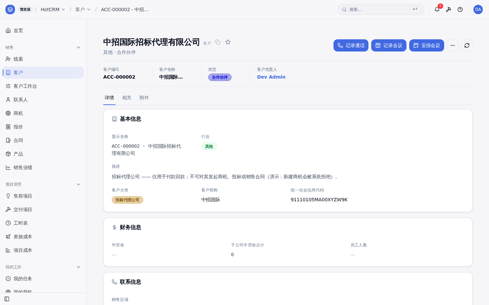
*S01c-招标代理类客户 — 招标代理类客户：只用于付款回款*

### 步骤 2 · 客户联系人信息维护

- **需求表系统路径**：`CRM→客户管理→客户详情→联系人维护` · **状态**：部分
- **点哪里**：客户详情 → 「相关」页签 → 联系人。
- **看什么 · 怎么讲**：王志强（信息中心主任）、李晓燕（采购部经理）两条；点「新建」可直接加。姓名、部门、职务、联系方式齐全。
- **口径**：未做：性别、角色、对我司态度、与销售关系强度（生产版加 4 个字段）。

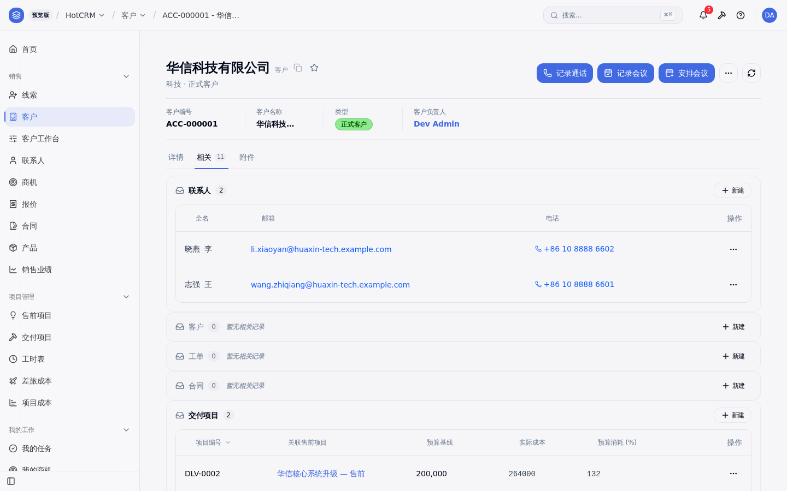
*S02-客户联系人 — 客户相关列表：联系人 2 条，下方还挂着交付项目*

### 步骤 3 · 客户业务信息完善

- **需求表系统路径**：`CRM→客户管理→客户详情→业务信息维护` · **状态**：未做
- **点哪里**：不点。
- **看什么 · 怎么讲**：口径：主要服务商、本年度 IT 采购预算、付款周期、美国 EAR 管制清单、战略合作伙伴标识 5 个字段生产版补齐；演示里由客户「描述」承载（"年度 IT 采购预算约 1.2 亿元…"）。EAR 只告警不阻断，人工确认才拦。

### 步骤 4 · 客户附件上传

- **需求表系统路径**：`CRM→客户管理→客户详情→附件上传` · **状态**：复用
- **点哪里**：客户详情 → 「附件」页签 → 上传。
- **看什么 · 怎么讲**：资质文件、合作背景资料直接拖进来，平台能力，零开发。

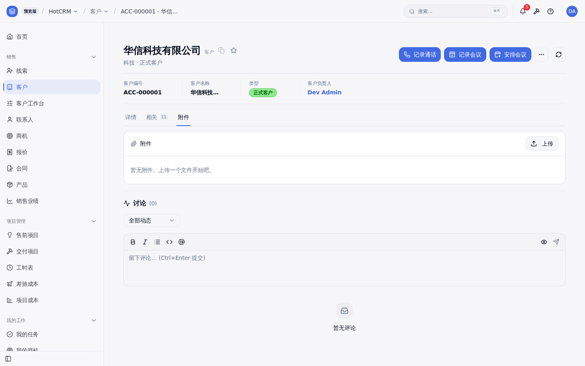
*S04-客户附件 — 客户附件页签*

### 步骤 5 · 客户信息审批

- **需求表系统路径**：`CRM→审批中心→待审批客户` · **状态**：新增
- **点哪里**：打开「东方联合银行」（审批状态 草稿）→ 编辑 → 审批状态改为「提交审批」→ 保存。
- **看什么 · 怎么讲**：保存后记录被锁定、显示「审批中已锁定」，请求进入审批中心。处理动作放到环节三末尾，和线索、商机立项一起批量通过——一个收件箱处理所有审批。

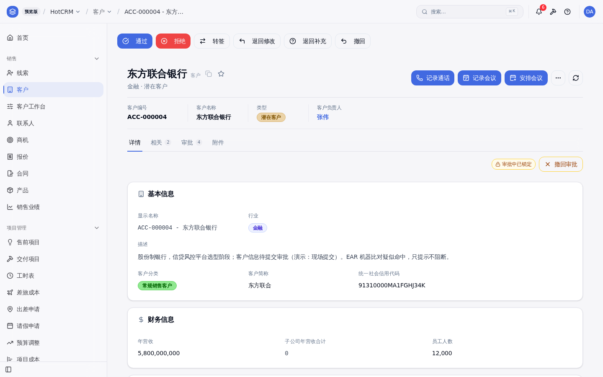
*S05-客户提交审批-审批中 — 客户提交审批后：记录锁定，审批中*

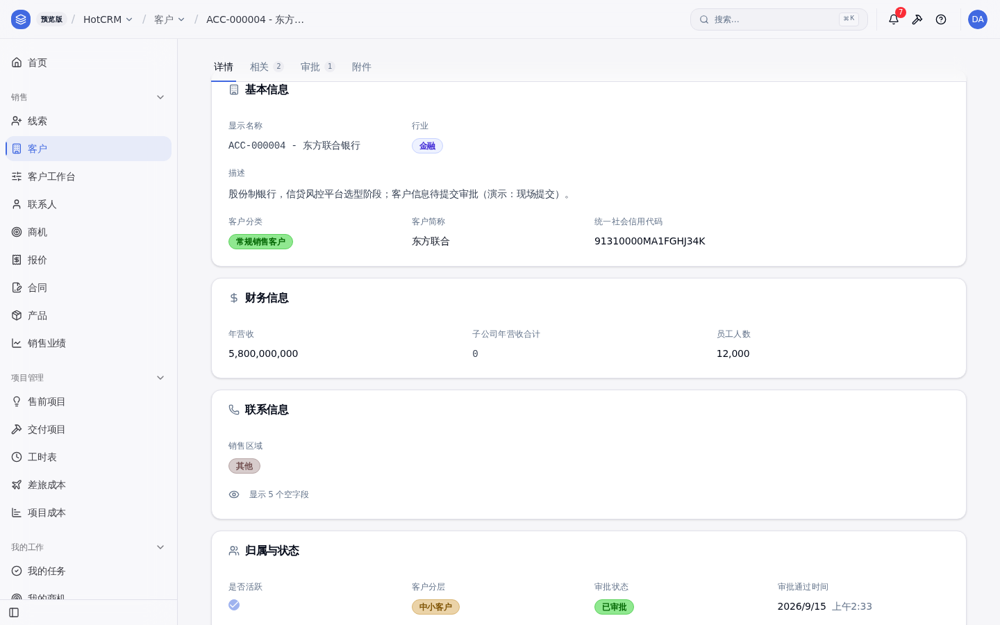
*S05b-客户已审批 — 审批通过后：已审批 + 审批通过时间*

## 2. 线索管理（Excel 步骤 6–7 · 3 分钟）

客户的"需求形"线索：预计金额与需求类型是新加的，审批通过后才转商机。

### 步骤 6 · 线索信息录入

- **需求表系统路径**：`CRM→线索管理→新增线索` · **状态**：扩展
- **点哪里**：销售 → 线索 → 打开「王志强 / 华信科技有限公司」→ 详情下方「需求与审批」。
- **看什么 · 怎么讲**：线索来源 = 合作伙伴，需求类型 = 软件开发，预计金额 1,400,000，审批状态 = 已审批；客户意向写在描述里。
- **口径**：未做：独立的"线索名称"（现以联系人 + 公司命名）。

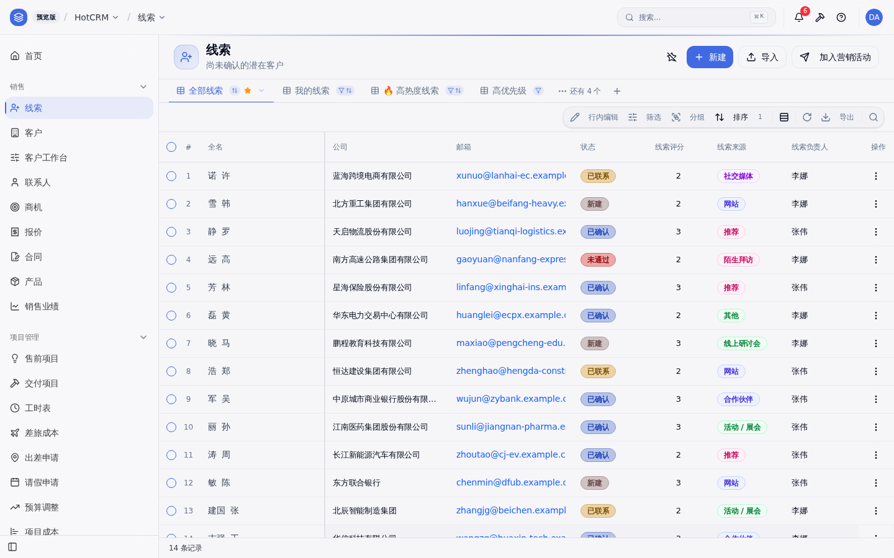
*S06-线索列表 — 线索列表*

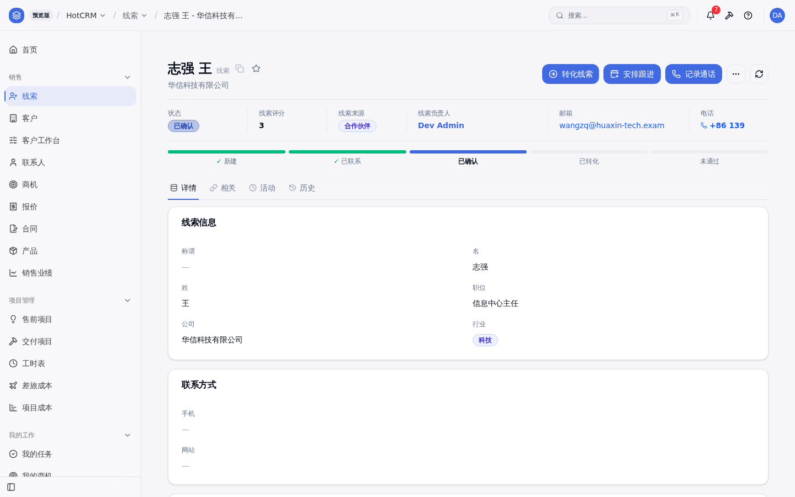
*S06b-线索详情 — 线索详情*

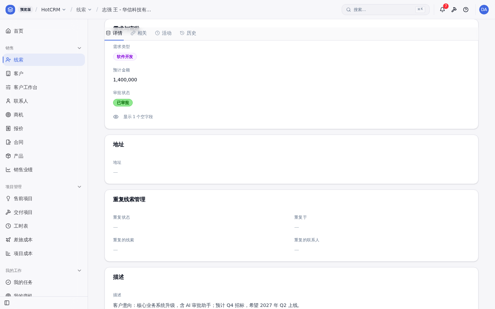
*S06c-线索-预计金额与需求类型 — 需求与审批：需求类型 / 预计金额 / 审批状态*

### 步骤 7 · 线索审批

- **需求表系统路径**：`CRM→审批中心→待审批线索` · **状态**：新增
- **点哪里**：打开「张建国 / 北辰智能制造集团」→ 编辑 → 审批状态「提交审批」→ 保存。
- **看什么 · 怎么讲**：同客户审批：锁定 + 进收件箱。话术：生产版在"转化线索"前加门禁，未审批通过不能转。

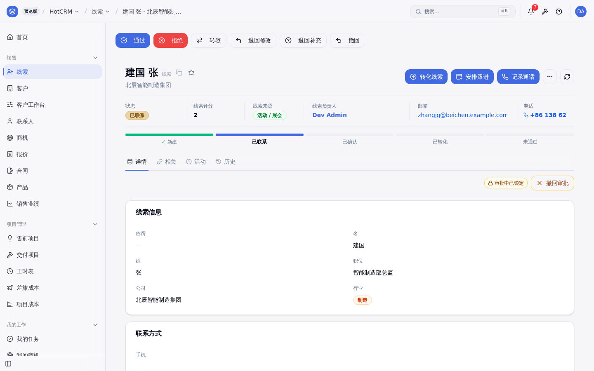
*S07-线索提交审批-审批中 — 线索提交后：审批中*

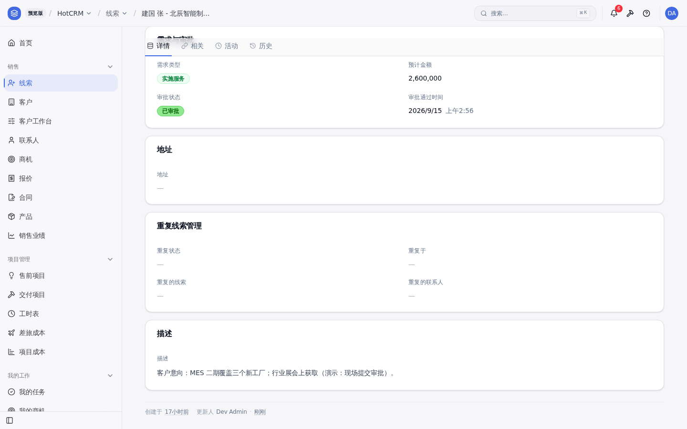
*S07b-线索已审批 — 通过后：已审批 + 时间戳*

## 3. 商机立项（Excel 步骤 8–11 · 8 分钟）

商机编码是项管平台唯一的关联锚点；立项是客户流程的关键门；招标代理客户在这里被系统拦下。

### 步骤 8 · 商机跟单信息填写

- **需求表系统路径**：`CRM→商机管理→新增商机→跟单信息` · **状态**：扩展
- **点哪里**：销售 → 商机 → 打开「华信科技核心业务系统升级项目」→ 详情 → 「跟单信息」分组。
- **看什么 · 怎么讲**：商机编码 OPP-0001 由系统自动编号（项管平台关联用）；是否投标 ✓、商机级别 A、优先级 高；顶部金额 1,400,000、成交概率 60%、预计成交日期。
- **口径**：未做：可控性、客户立项时间、预计招标时间、分包信息（生产版：招投标字段组）。

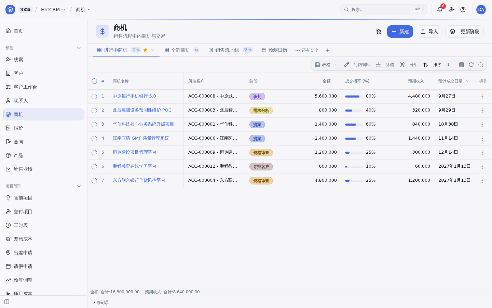
*S08-商机列表 — 商机列表：三条商机，含一条已成交*

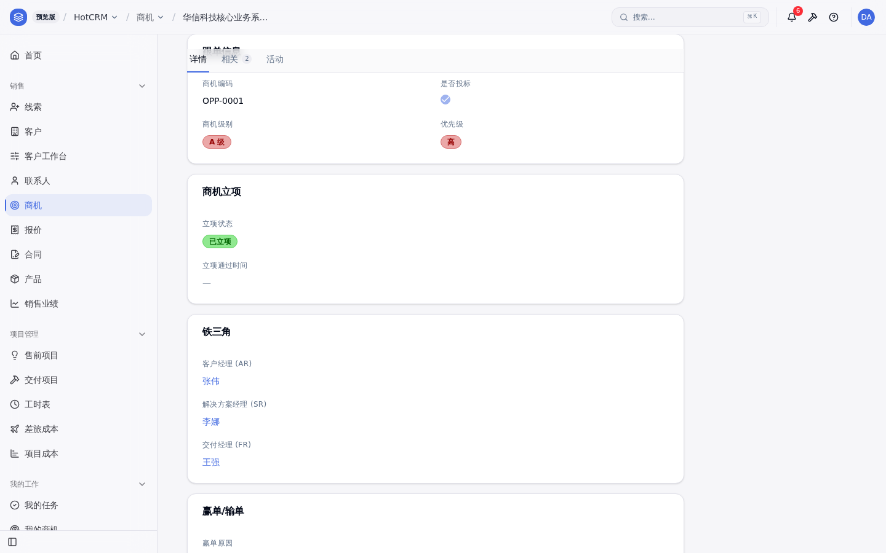
*S08b-商机跟单信息 — 跟单信息 / 商机立项 / 铁三角三个分组*

### 步骤 1·备注 / 8 · 系统拦截 ① 招标代理客户不能发起商机 🚫

- **需求表系统路径**：`CRM→商机管理→新建商机` · **状态**：新增
- **点哪里**：商机 → 新建 → 商机名称随意 → 所属客户选「中招国际招标代理有限公司」→ 阶段 / 金额 / 预计成交日期 → 创建。
- **看什么 · 怎么讲**：系统拒绝并提示：「客户「中招国际招标代理有限公司」为招标代理/其他类客户，仅可用于付款回款，无法发起商机」。话术：这是跨对象的门禁——读的是客户上的分类；存量数据不受影响。

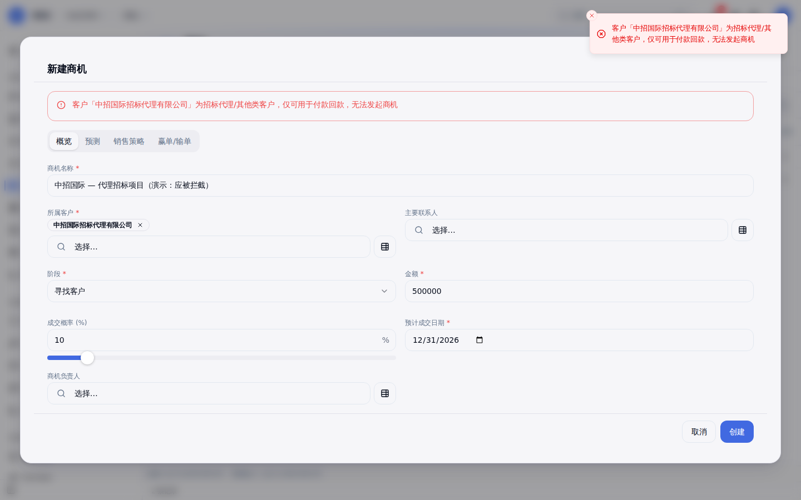
*S01d-拦截-招标代理不可发起商机 — 拦截 ①：表单顶部与右上角同时提示*

### 步骤 9 · 商机主体信息关联

- **需求表系统路径**：`CRM→商机管理→商机详情→主体信息` · **状态**：部分
- **点哪里**：同一商机顶部与「商机信息」分组。
- **看什么 · 怎么讲**：所属客户 ACC-000001 华信科技有限公司；项目名称即商机名称；类型 = 新业务。
- **口径**：未做：软通签约主体、业务分类、收入确认类型（签约主体在生产版是独立的"法人主体"对象）。

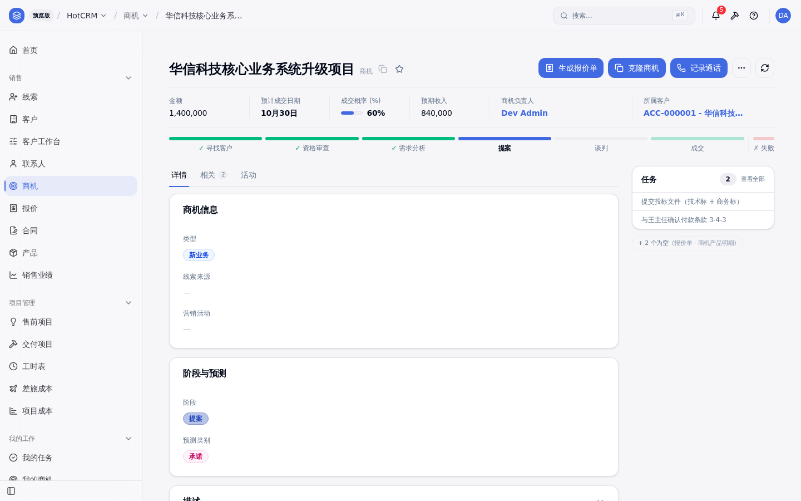
*S09-商机详情-主体信息 — 商机详情：所属客户、金额、阶段条*

### 步骤 10 · 商机背景与附件补充

- **需求表系统路径**：`CRM→商机管理→商机详情→其他信息` · **状态**：复用
- **点哪里**：详情底部「描述」分组。
- **看什么 · 怎么讲**：客户简介 / 项目背景 / 风险分析 / 付款条款 3-4-3 / 下包说明按结构写在描述里；「下一步」单独一栏。附件与客户一样是平台能力。

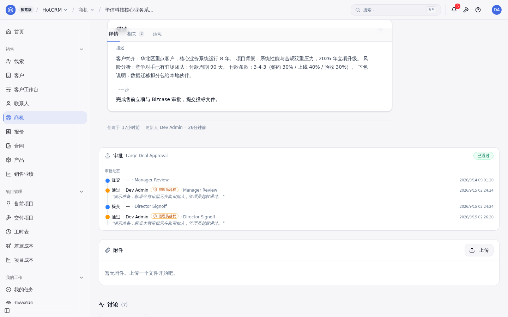
*S10-商机背景说明 — 描述与下一步*

### 步骤 11 · 商机立项审批

- **需求表系统路径**：`CRM→审批中心→待立项商机` · **状态**：新增
- **点哪里**：打开「东方联合银行信贷风控平台」（立项状态 未立项）→ 编辑 → 立项状态「提交立项」→ 保存。
- **看什么 · 怎么讲**：记录锁定，「商机立项」分组显示 立项审批中。这条审批与标准产品按金额分档的大额审批相互独立。

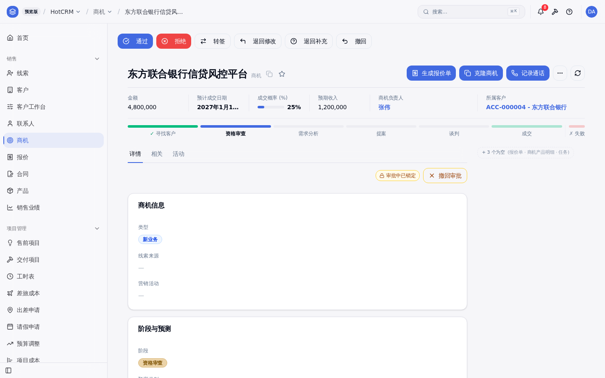
*S11-商机立项审批中 — 提交立项后：审批中已锁定*

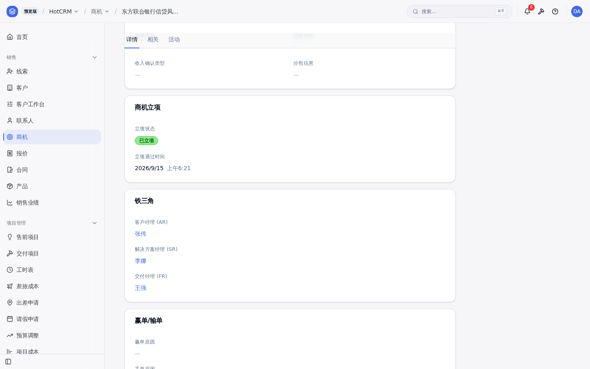
*S11b-商机已立项 — 通过后：已立项 + 立项通过时间*

### 步骤 5 · 7 · 11 · 审批中心：一个收件箱处理所有审批

- **需求表系统路径**：`CRM→审批中心` · **状态**：新增
- **点哪里**：我的工作 → 待我审批。
- **看什么 · 怎么讲**：三条请求在一起：客户审批、线索审批、商机立项审批。点标题打开详情面板（通过 / 拒绝 / 转签 / 退回修改 / 退回补充 / 催办 / 撤回都在这里）；勾选全部 → 「通过 3 条」→ 确认 → 列表清空。回到三条记录：已审批 + 审批通过时间、已立项 + 立项通过时间，负责人收到通知。快捷键 x 选择 · a 通过 · r 拒绝。
- **口径**：详情面板里的字段名是平台面板直出的英文原名，演示时用列表行勾选 + 通过即可。

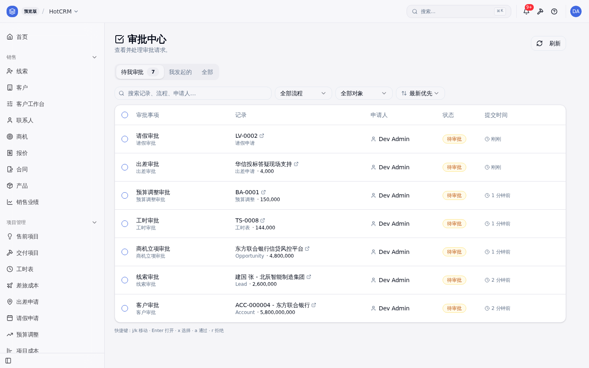
*S05-07-11-审批中心-待我审批 — 待我审批：三条*

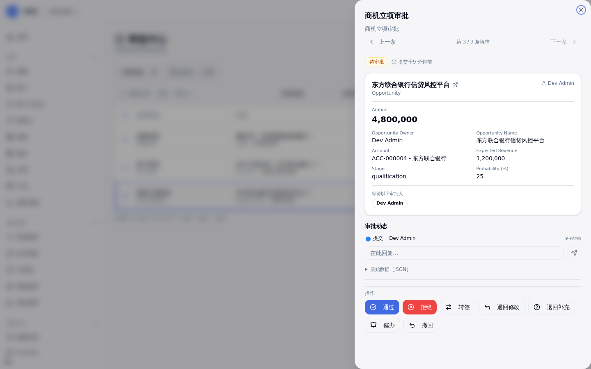
*S05-07-11b-审批请求详情 — 请求详情面板与全部动作*

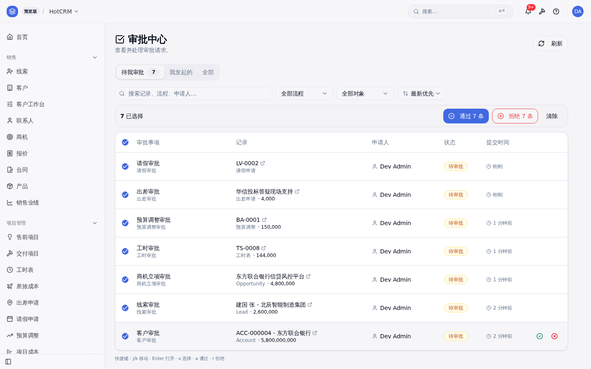
*S05-07-11c-勾选后批量通过 — 勾选后出现「通过 3 条」*

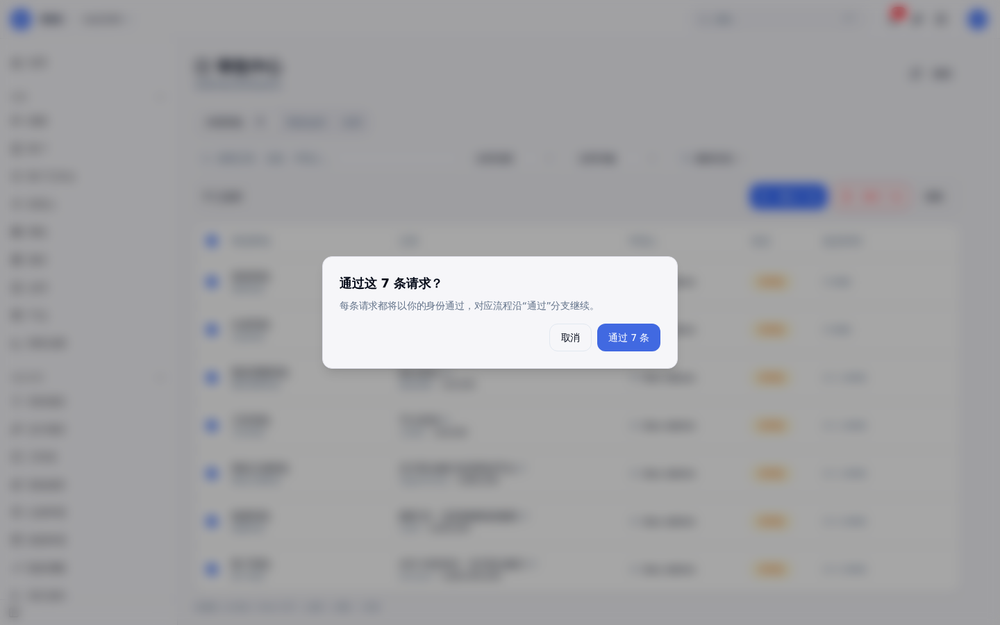
*S05-07-11d-确认通过 — 确认对话框*

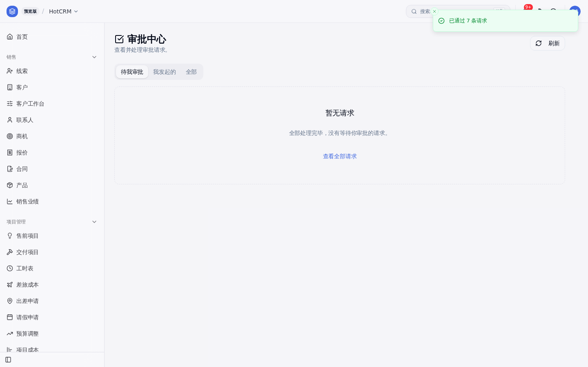
*S05-07-11e-审批已处理 — 处理完毕，收件箱清空*

## 4. 商机跟进（Excel 步骤 12–14 · 4 分钟）

阶段、任务、活动是标准能力；铁三角与赢单原因是为这个客户加的。

### 步骤 12 · 商机日常跟进维护

- **需求表系统路径**：`CRM→商机管理→已立项商机→跟进记录` · **状态**：复用
- **点哪里**：华信商机 → 「活动」页签；再看「相关」页签 → 待办任务。
- **看什么 · 怎么讲**：活动时间线自动记录阶段 / 字段变更，可留评论；待办任务 2 条（提交投标文件、确认付款条款 3-4-3），右侧任务卡常驻；阶段条可直接推进阶段，赢单概率、预计金额随时改。

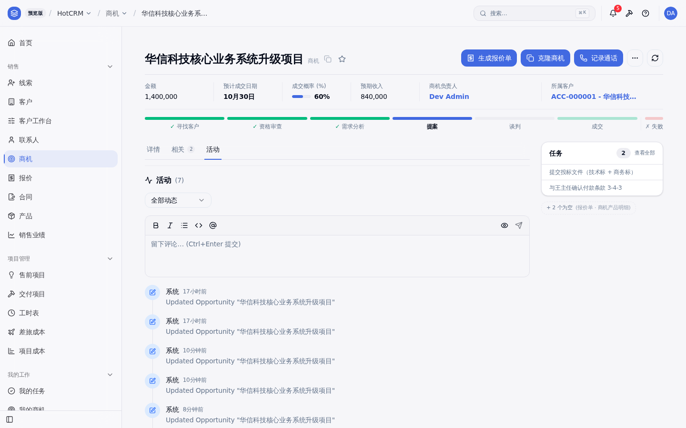
*S12-商机活动时间线 — 活动时间线*

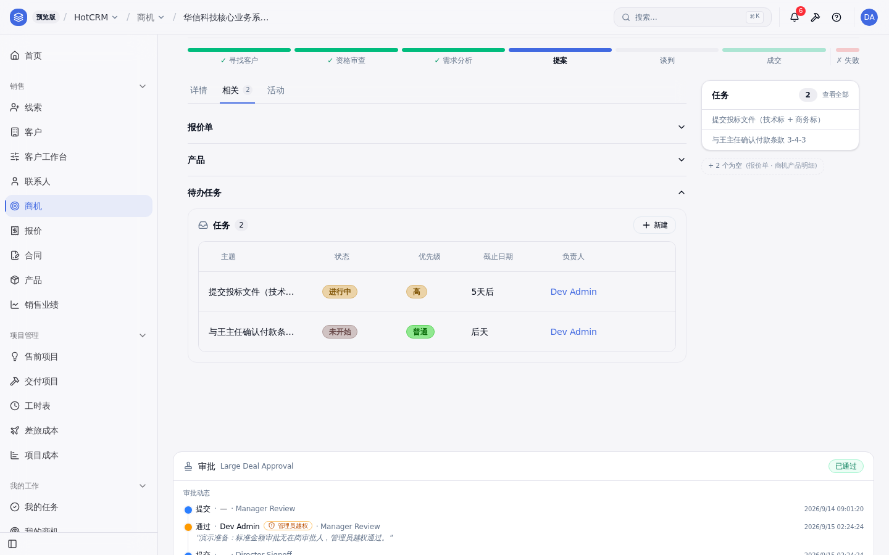
*S12b-商机相关-待办任务 — 相关：待办任务*

### 步骤 13 · 商机状态变更（赢单 / 弃单 / 铁三角调整）

- **需求表系统路径**：`CRM→商机管理→商机详情→状态变更` · **状态**：扩展
- **点哪里**：华信商机详情 → 「铁三角」分组；再打开「北辰集团 MES 二期」。
- **看什么 · 怎么讲**：铁三角：客户经理 张伟 / 解决方案经理 李娜 / 交付经理 王强，铅笔图标就地改人。北辰 MES 二期阶段 = 成交，「赢单/输单」分组：赢单原因 = 客户关系，赢/丢单详情写明原因——赢单 / 丢单时系统要求填原因。
- **口径**：生产版：铁三角做成商机团队联结对象 + 记录级共享。

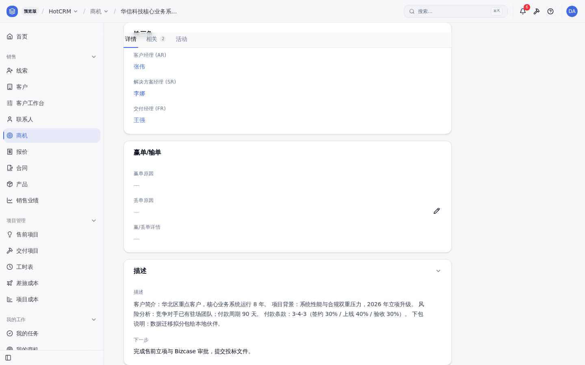
*S13-铁三角 — 铁三角三个角色*

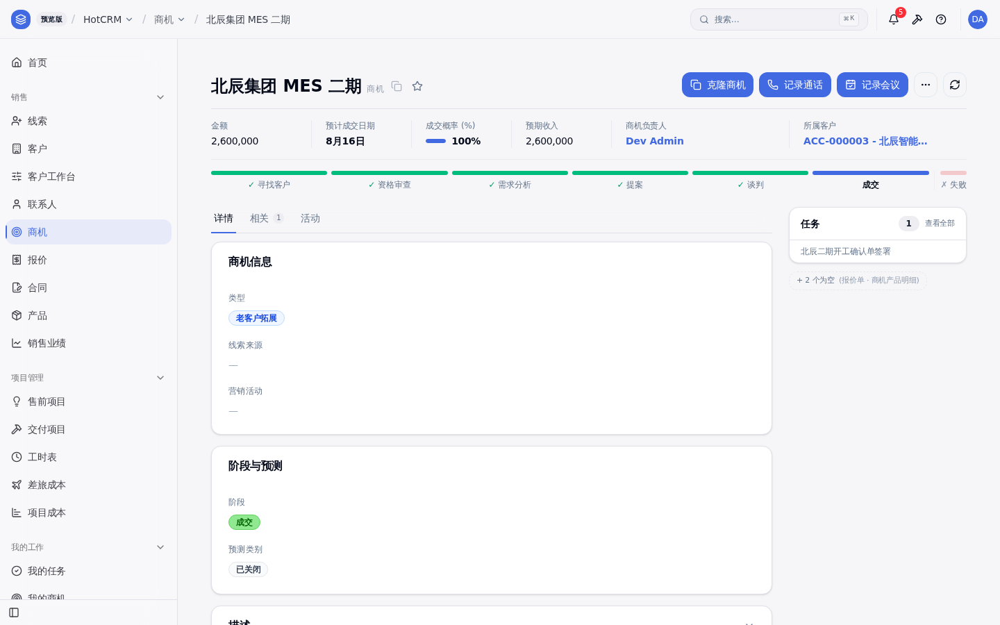
*S13b-赢单商机 — 已成交商机*

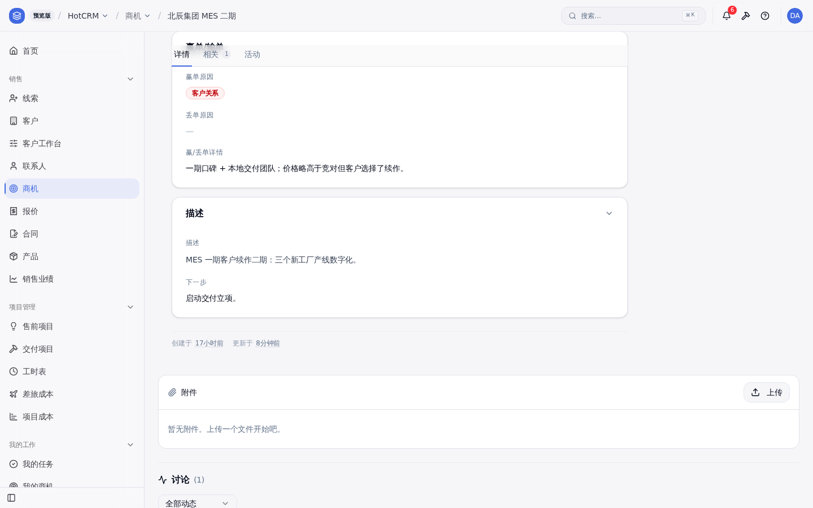
*S13c-赢单原因 — 赢单原因与详情*

### 步骤 14 · 商机状态变更审批

- **需求表系统路径**：`CRM→审批中心→待审批状态变更` · **状态**：未做
- **点哪里**：不点。
- **看什么 · 怎么讲**：口径：赢单 / 弃单 / 铁三角调整不单独走审批，立项审批已覆盖"立项"这一关键状态；需要时按同一机制再加一条流程。

## 5. 售前项目立项（Excel 步骤 15–20 · 5 分钟）

从这里起是"项管平台"——同一套平台、同一套元数据里长出来的五个新对象。

### 步骤 15 · 关联 CRM 商机数据

- **需求表系统路径**：`项管平台→售前立项→选择 CRM 商机编码` · **状态**：新增
- **点哪里**：项目管理 → 售前项目 → 打开 PSP-0001「华信核心系统升级 — 售前」。
- **看什么 · 怎么讲**：顶部「关联商机」= 华信科技核心业务系统升级项目——必填，只能挂在已有商机上；所属客户跟着带出。

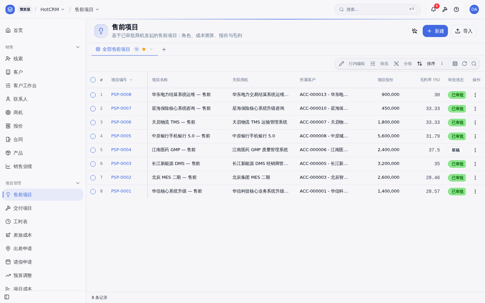
*S15-售前项目列表 — 售前项目列表*

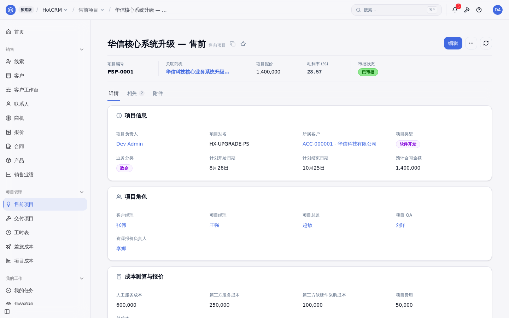
*S15b-售前项目-关联商机 — 售前项目：关联商机、报价、毛利率、审批状态*

### 步骤 16 · 项目基本信息填报

- **需求表系统路径**：`项管平台→售前立项→新增售前项目` · **状态**：新增
- **点哪里**：同一页「项目信息」分组。
- **看什么 · 怎么讲**：项目别名 HX-UPGRADE-PS、项目类型 软件开发、业务分类 政企、计划起止日期、预计合同金额 1,400,000。

### 步骤 17 · 项目角色配置

- **需求表系统路径**：`项管平台→售前立项→项目角色设置` · **状态**：新增
- **点哪里**：「项目角色」分组。
- **看什么 · 怎么讲**：客户经理 张伟 / 项目经理 王强 / 项目总监 赵敏 / 项目 QA 刘洋 / 资源报价负责人 李娜——五个角色都是人员查找字段。

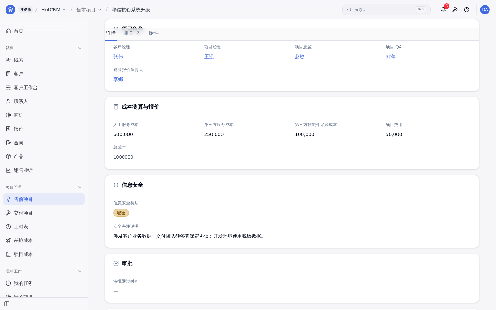
*S17-项目角色 — 售前项目角色*

### 步骤 18 · 项目成本与报价测算

- **需求表系统路径**：`项管平台→售前立项→成本测算` · **状态**：新增
- **点哪里**：「成本测算与报价」分组。
- **看什么 · 怎么讲**：人工 600,000 + 第三方服务 250,000 + 软硬件采购 100,000 + 项目费用 50,000 → 总成本 1,000,000 是公式；报价 1,400,000 → 毛利率 28.57% 也是公式，顶部常显。改任一项成本，两个数当场变。
- **口径**：简化：岗位级别 × 费率标准的费率卡未做，成本按四类直接填。

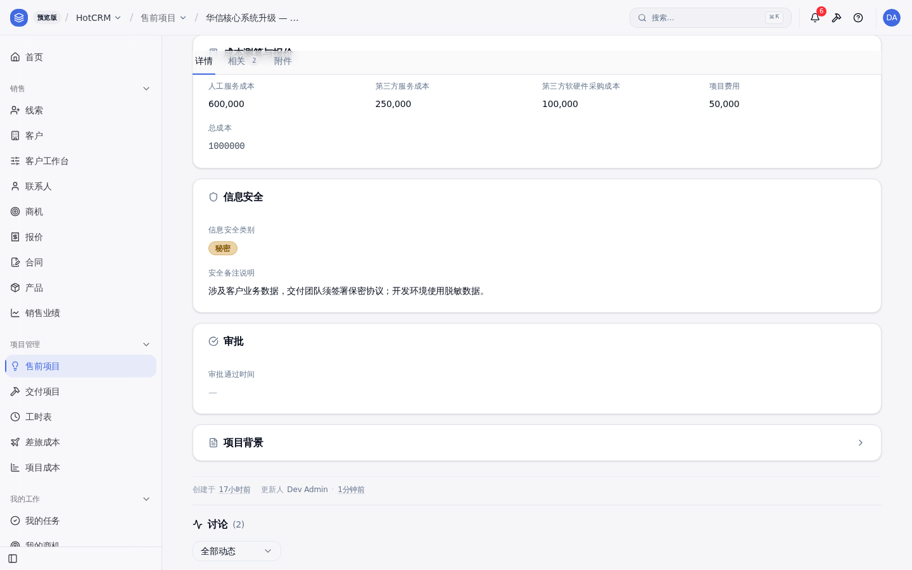
*S18-成本测算与报价 — 四项成本与总成本*

### 步骤 19 · 信息安全类别设置

- **需求表系统路径**：`项管平台→售前立项→信息安全设置` · **状态**：新增
- **点哪里**：「信息安全」分组。
- **看什么 · 怎么讲**：信息安全类别 = 秘密（公开 / 内部 / 秘密 / 机密），安全备注说明。

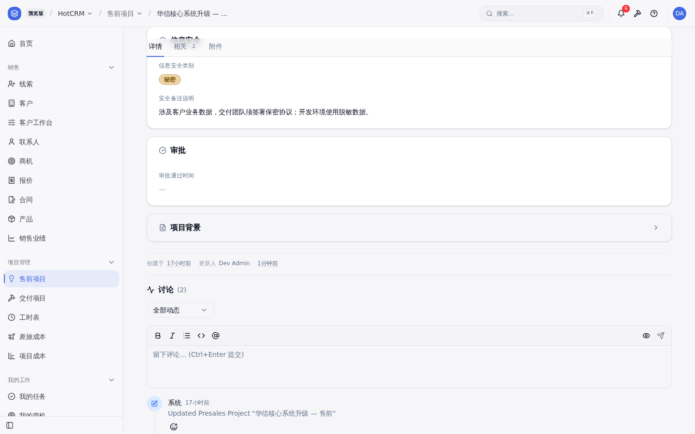
*S19-信息安全 — 信息安全类别与备注*

### 步骤 20 · 售前立项逐级审批

- **需求表系统路径**：`项管平台→审批中心→待审批售前立项` · **状态**：简化
- **点哪里**：「审批」分组 + 顶部审批状态。
- **看什么 · 怎么讲**：机制与环节三完全相同：审批状态改「提交审批」→ 待我审批 → 通过。话术：客户要的是五级链（成本中心负责人 → 事业部负责人 → Bizcase 审核岗 → 事业本部负责人 → 事业群运营负责人），演示为一级；生产版五个审批节点串联，按组织层级路由。

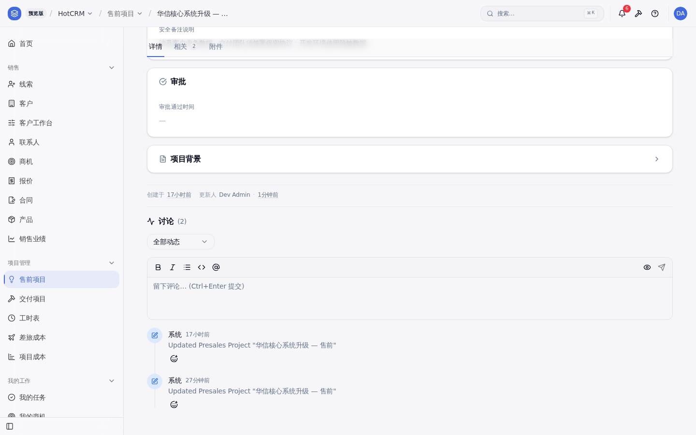
*S20-售前立项审批状态 — 售前项目的审批分组（种子数据直接置为已审批，时间戳由流程在现场通过时写入）*

## 6. 交付项目立项（Excel 步骤 21–26 · 4 分钟）

交付项目必须挂在已审批的售前项目上；成本中心、角色、信息安全、附件、审批一页看全。

### 步骤 21 · 关联售前立项结果

- **需求表系统路径**：`项管平台→交付立项→选择售前项目` · **状态**：新增
- **点哪里**：项目管理 → 交付项目 → 打开 DLV-0001「华信核心系统升级 — 一期交付」。
- **看什么 · 怎么讲**：顶部「关联售前项目」= 华信核心系统升级 — 售前（必填）；预算基线、实际成本、预算消耗 % 也在顶部。

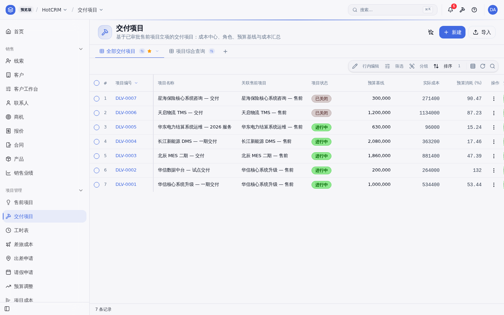
*S21-交付项目列表 — 交付项目列表：两个项目的基线 / 实际 / 消耗*

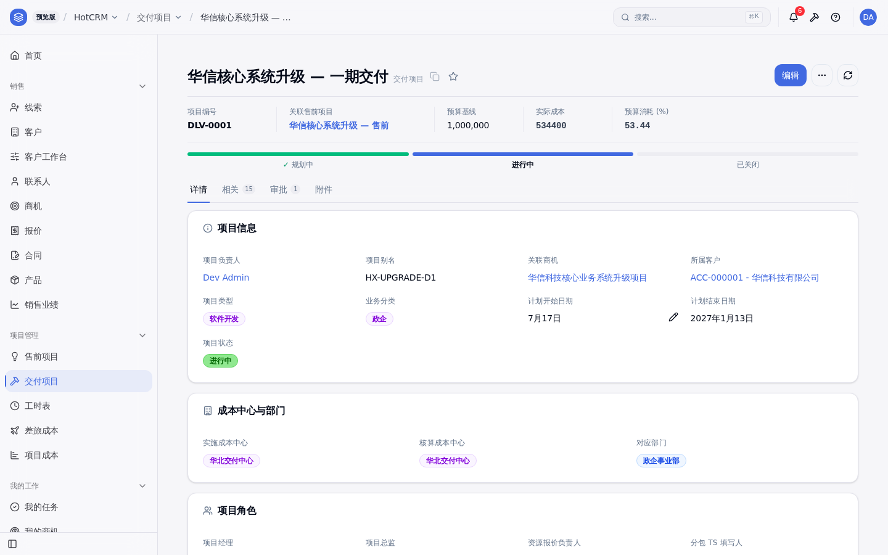
*S21b-交付项目-关联售前项目 — 交付项目：关联售前项目与项目信息*

### 步骤 22 · 项目基础信息完善

- **需求表系统路径**：`项管平台→交付立项→完善项目信息` · **状态**：新增
- **点哪里**：「项目信息」分组。
- **看什么 · 怎么讲**：别名 HX-UPGRADE-D1、类型、业务分类、计划起止；项目状态 = 进行中，顶部状态条 规划中 → 进行中 → 已关闭。

### 步骤 23 · 成本中心与核算主体配置

- **需求表系统路径**：`项管平台→交付立项→成本中心设置` · **状态**：新增
- **点哪里**：「成本中心与部门」分组。
- **看什么 · 怎么讲**：实施成本中心 华北交付中心 / 核算成本中心 华北交付中心 / 对应部门 政企事业部。试点项目的实施中心是华东、核算仍在华北——两个中心可以不同。

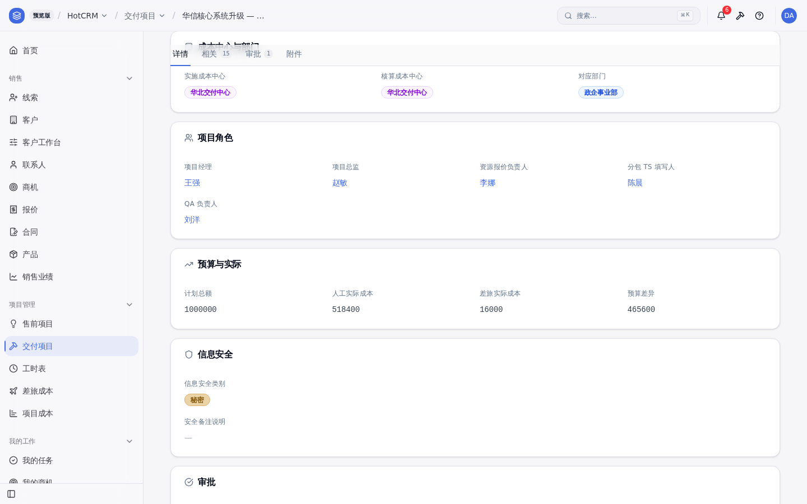
*S23-成本中心与部门 — 成本中心与部门、项目角色、预算与实际*

### 步骤 24 · 项目角色与组织配置

- **需求表系统路径**：`项管平台→交付立项→项目角色设置` · **状态**：新增
- **点哪里**：「项目角色」分组。
- **看什么 · 怎么讲**：项目经理 王强 / 项目总监 赵敏 / 资源报价负责人 李娜 / 分包 TS 填写人 陈晨 / QA 负责人 刘洋。

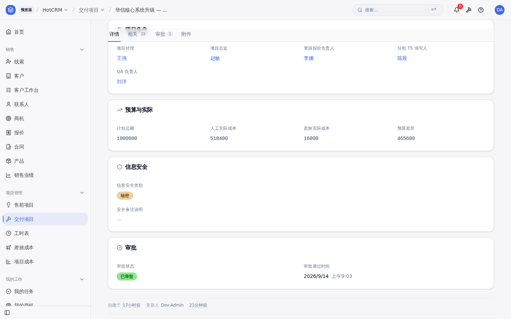
*S24-项目角色 — 交付项目角色*

### 步骤 25 · 信息安全设置与附件上传

- **需求表系统路径**：`项管平台→交付立项→信息安全 + 附件管理` · **状态**：新增
- **点哪里**：「信息安全」分组；「附件」页签。
- **看什么 · 怎么讲**：信息安全类别 = 秘密；附件页签上传开工确认单。

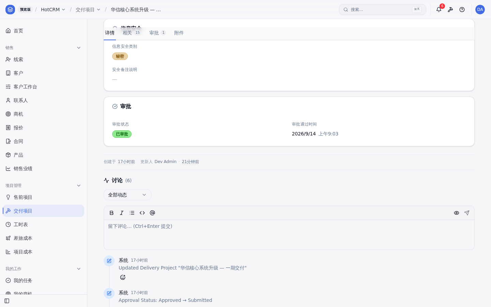
*S25-信息安全 — 信息安全*

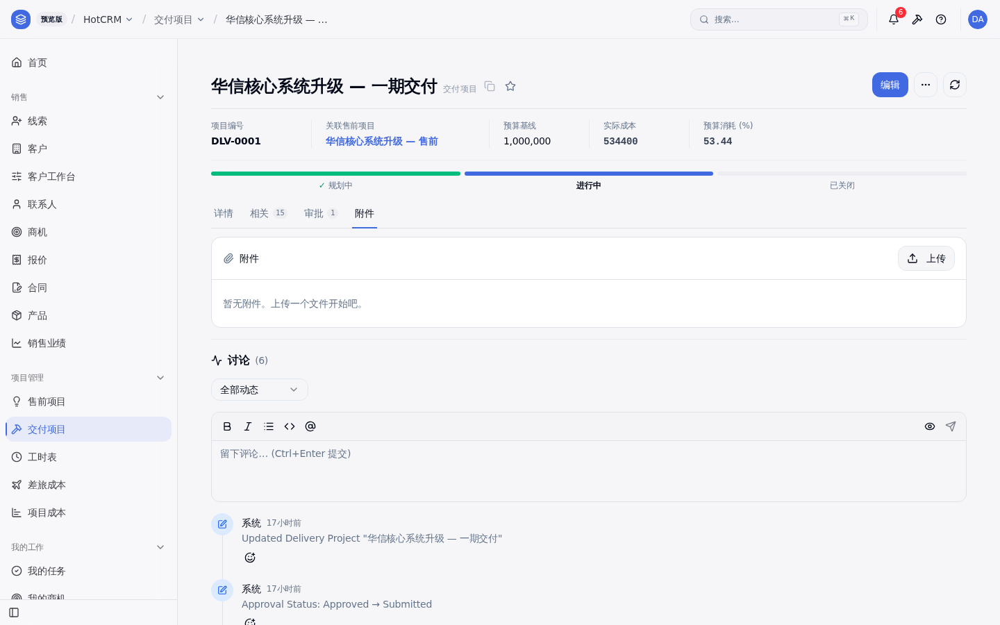
*S25b-开工确认单附件 — 附件页签：上传开工确认单*

### 步骤 26 · 交付立项审批

- **需求表系统路径**：`项管平台→审批中心→待审批交付立项` · **状态**：新增
- **点哪里**：「审批」分组；记录页「审批」页签。
- **看什么 · 怎么讲**：已审批 + 审批通过时间；「审批」页签保留整条审批历史。机制同前。

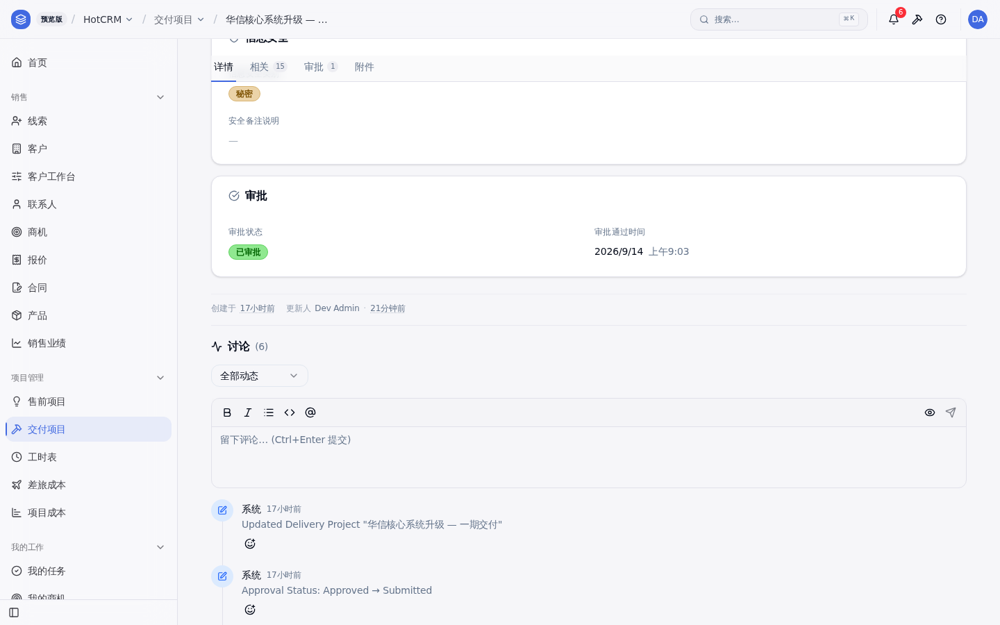
*S26-交付立项审批状态 — 交付立项审批状态*

## 7. 成本计划管理（Excel 步骤 27–32 · 4 分钟）

预算基线 + 四类成本计划行按月分解，计划总额自动汇总。

### 步骤 27 · 预算基线导入

- **需求表系统路径**：`项管平台→成本计划→导入 Bizcase 预算` · **状态**：简化
- **点哪里**：DLV-0001 顶部「预算基线」与「预算与实际」分组。
- **看什么 · 怎么讲**：预算基线 1,000,000 = 售前 Bizcase 总成本；演示为手工带入。生产版：售前审批通过时自动写入交付项目。

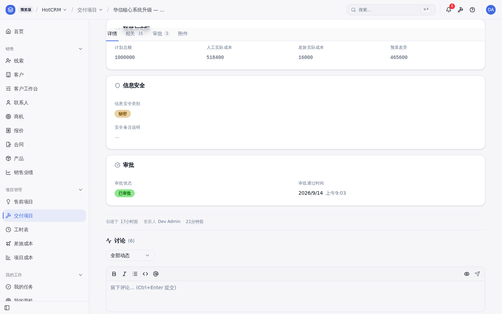
*S27-预算基线与计划总额 — 预算与实际：计划总额 / 人工实际 / 差旅实际 / 预算差异*

### 步骤 28–31 · 人工服务 / 第三方服务 / 软硬件采购 / 项目费用 成本计划编制

- **需求表系统路径**：`项管平台→成本计划→四类成本配置` · **状态**：新增
- **点哪里**：DLV-0001 → 「相关」页签 → 成本计划行；或直接打开成本计划行列表。
- **看什么 · 怎么讲**：8 行：四个类别 × 第 1、2 月；每行 数量 × 单价 = 计划金额（人工行：640 工时 × 468.75；第三方：分包 125,000；采购：中间件许可 2 × 25,000；费用：差旅与驻场）。「预算与实际」里计划总额 1,000,000 自动汇总，点「新建」加一行立刻变。
- **口径**：简化：岗位级别 / 费率标准 / 人数在"说明 + 数量 + 单价"三个字段里表达，生产版拆成费率卡。

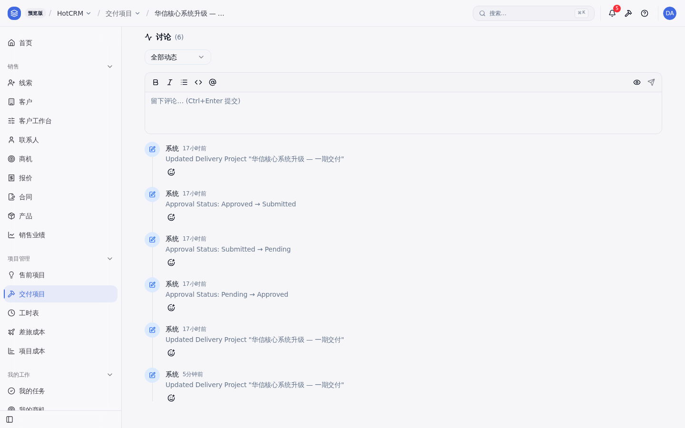
*S28-31-成本计划行 — 交付项目相关：成本计划行 8 条*

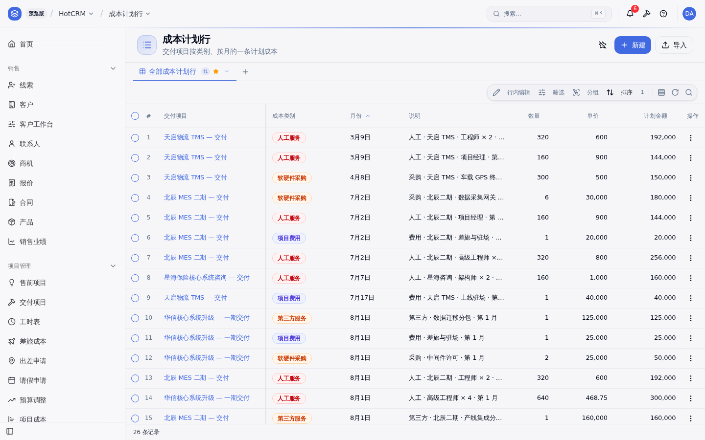
*S28-31b-成本计划行列表 — 成本计划行列表：类别 / 月份 / 数量 / 单价 / 计划金额*

### 步骤 32 · 成本计划调整与审批

- **需求表系统路径**：`项管平台→成本计划→预算调整→提交审批` · **状态**：未做
- **点哪里**：不点。
- **看什么 · 怎么讲**：口径：预算追加的调整原因、差异分析、审批流生产版做成"预算调整"对象 + 一条同形审批流。

## 8. 成本执行管理（Excel 步骤 33–36 · 6 分钟）

工时 × 费率自动算成本，实时汇总到项目；超预算的项目被系统拒绝填报。

### 步骤 33 · 月度工时填报（TS 填写）

- **需求表系统路径**：`项管平台→工时填写→TS 月度填写→选择对应项目` · **状态**：简化
- **点哪里**：项目管理 → 工时表 → 新建：交付项目选「一期交付」、月份、工时 8、费率 800 → 创建。
- **看什么 · 怎么讲**：详情页人工成本 6,400 是保存时自动算的（工时 × 费率），填报人 = 创建人；项目的实际成本与预算消耗 % 随之更新。售前项目可选，售前工时只记录不汇总。
- **口径**：简化：请假 / 加班同步（考勤系统集成）未做。

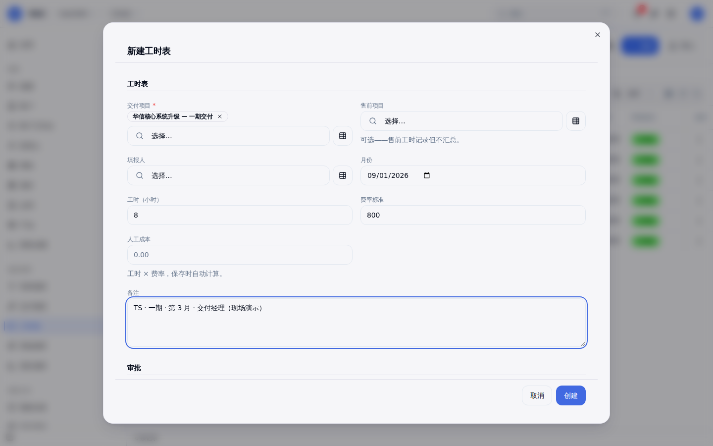
*S33-新建工时表 — 新建工时表：人工成本留空*

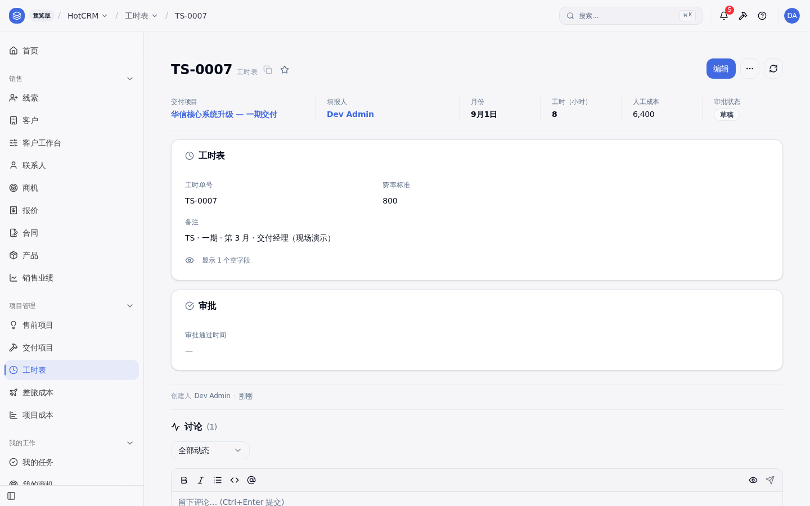
*S33b-工时表-人工成本自动计算 — 保存后：人工成本 6,400*

### 步骤 34 · 工时审批

- **需求表系统路径**：`项管平台→工时审批→待审批工时` · **状态**：新增
- **点哪里**：工时表详情 → 编辑 → 审批状态「提交审批」→ 保存 → 我的工作 → 待我审批 → 勾选 → 通过 1 条。
- **看什么 · 怎么讲**：锁定、进收件箱、通过、盖时间戳——与前面完全一样的机制，第六条流程。
- **口径**：演示里工时保存即汇总；生产版可把汇总改为只计已审批工时（汇总字段加过滤条件）。

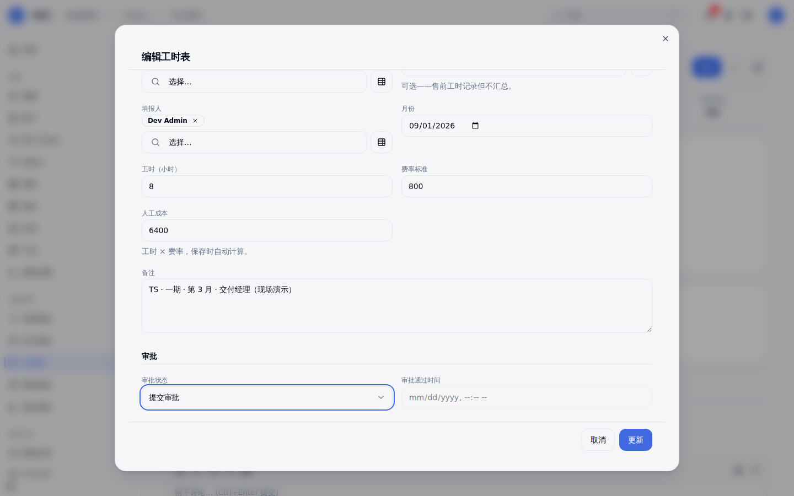
*S34-提交审批 — 编辑：审批状态 → 提交审批*

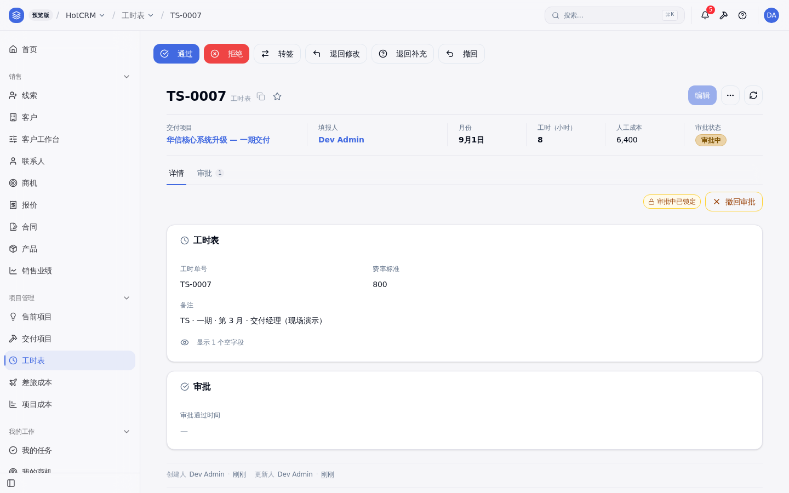
*S34b-工时表-审批中已锁定 — 审批中已锁定*

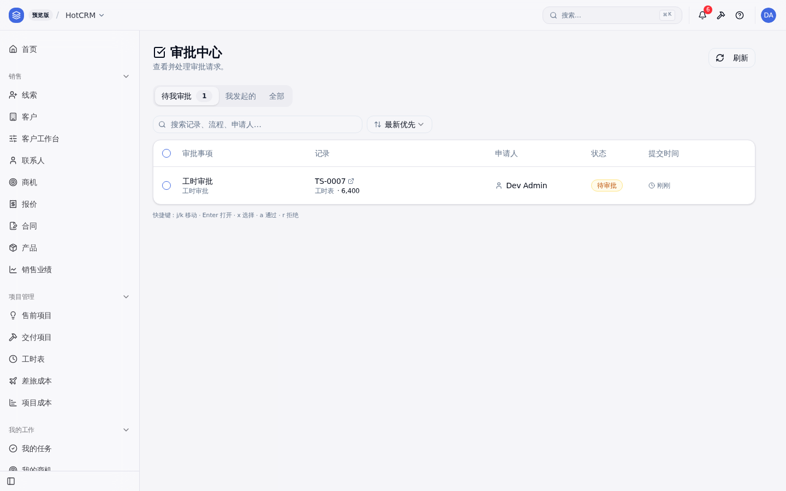
*S34c-审批中心-工时审批 — 待我审批：工时审批*

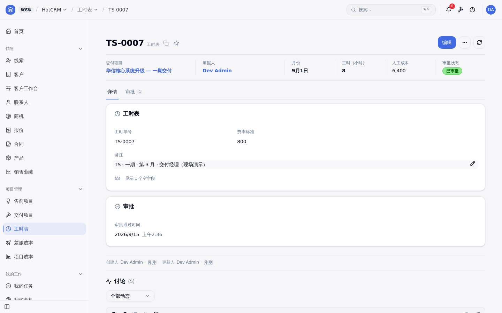
*S34d-工时表-已审批 — 已审批 + 审批通过时间*

### 步骤 35 · 差旅成本填报

- **需求表系统路径**：`项管平台→成本执行→差旅报销→关联项目` · **状态**：简化
- **点哪里**：项目管理 → 差旅成本。
- **看什么 · 怎么讲**：3 条，按项目归集：发生日期、金额、报销单据号 BX-…、说明；差旅实际汇总到项目。
- **口径**：简化：与报销系统对接未做。

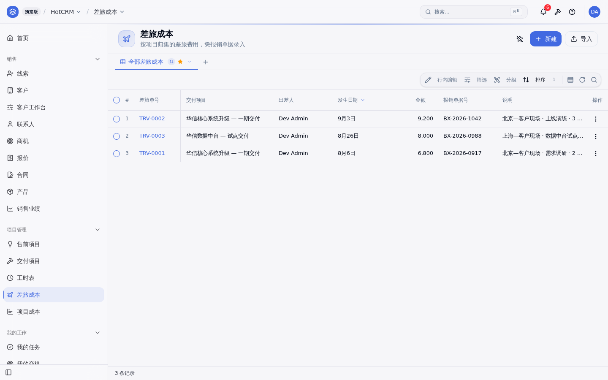
*S35-差旅成本列表 — 差旅成本列表*

### 步骤 36 · 成本超支预警与管控 🚫

- **需求表系统路径**：`项管平台→成本执行→成本监控` · **状态**：新增
- **点哪里**：交付项目 → DLV-0002「华信数据中台 — 试点交付」；然后 工时表 → 新建 → 交付项目选「试点交付」→ 创建。
- **看什么 · 怎么讲**：试点项目：预算基线 200,000、实际成本 264,000、预算消耗 132%。系统拦截 ②：「项目「华信数据中台 — 试点交付」成本已超预算（实际 264,000 ≥ 基线 200,000），工时填报已限制」。换成一期交付就能保存。

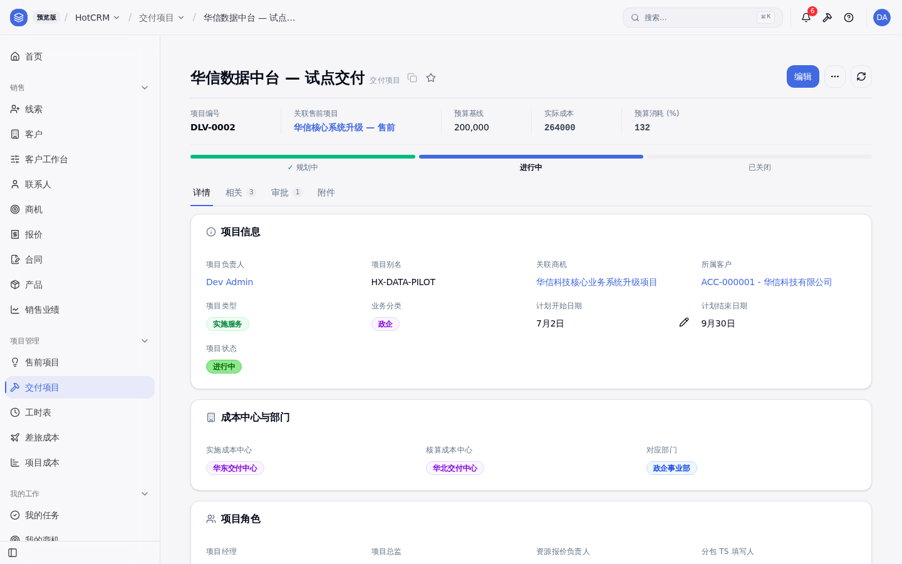
*S36-试点项目-超预算132 — 超预算项目：132%*

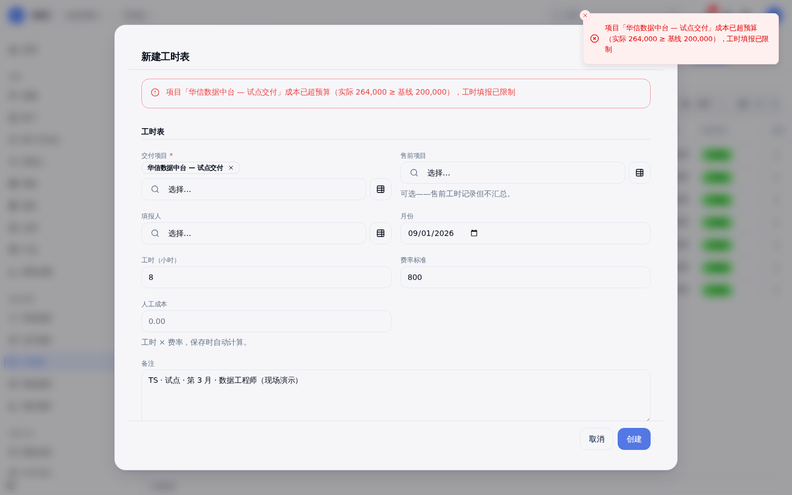
*S36b-拦截-超预算禁填工时 — 拦截 ②：超预算禁填工时*

## 9. 项目报表管理（Excel 步骤 37–40 · 3 分钟）

列表即综合查询；仪表板给财务和成本管理员看基线、实际与消耗。

### 步骤 37 · 项目综合信息查询

- **需求表系统路径**：`项管平台→项目报表→项目综合查询` · **状态**：部分
- **点哪里**：项目管理 → 交付项目。
- **看什么 · 怎么讲**：项目编号 / 名称 / 关联售前项目 / 状态 / 预算基线 / 实际成本 / 预算消耗 一行看全，可筛选、分组、导出；点入看成本计划行、工时表、差旅成本。
- **口径**：未做：进度、收入、开票、收款。

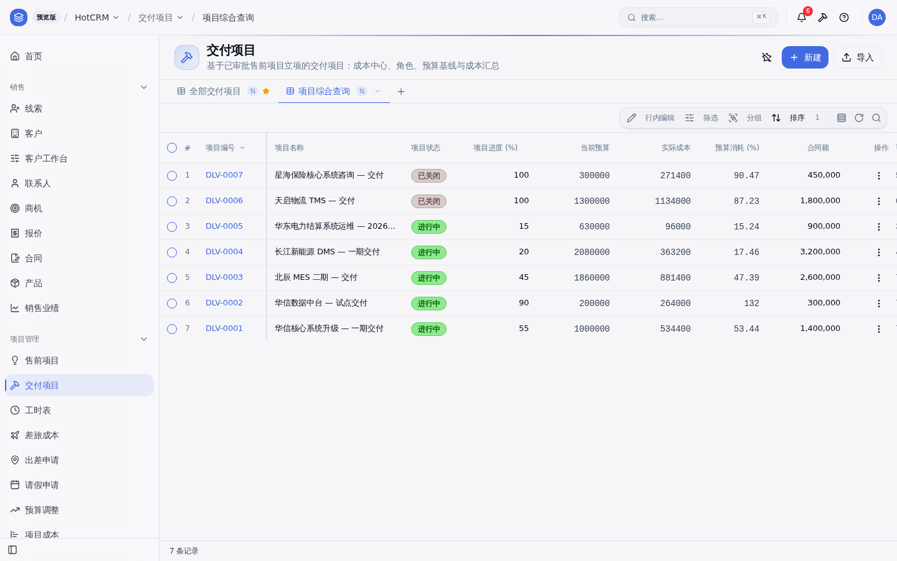
*S37-项目综合查询 — 交付项目列表*

### 步骤 38 · 项目财务数据查询

- **需求表系统路径**：`项管平台→项目报表→财务数据查询` · **状态**：部分
- **点哪里**：项目管理 → 项目成本。
- **看什么 · 怎么讲**：四块磁贴：总预算 1,200,000 / 人工实际 774,400 / 差旅实际 24,000 / 进行中项目 2。合同额 = 售前项目预计合同金额，毛利率在售前项目上。
- **口径**：未做：开票金额、收款金额——CRM 与项管平台均不建模，需明确归属系统。

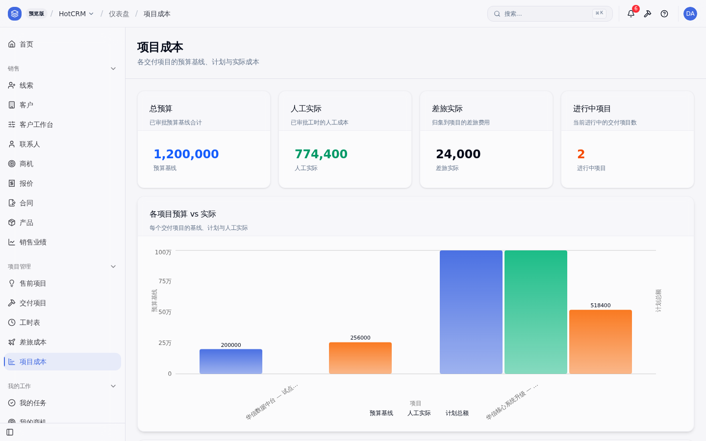
*S38-39-项目成本仪表板 — 项目成本仪表板*

### 步骤 39 · 项目成本跟踪监控

- **需求表系统路径**：`项管平台→项目报表→成本跟踪查询` · **状态**：新增
- **点哪里**：同一仪表板往下滚。
- **看什么 · 怎么讲**：柱状图：各项目预算基线 vs 计划总额 vs 人工实际；「各项目预算消耗」表：试点 128%、一期 52%。
- **口径**：仪表板消耗率 = 人工实际 ÷ 基线（分析 SQL 读不到公式字段）；记录页预算消耗 % = (人工 + 差旅) ÷ 基线，所以试点是 132%。

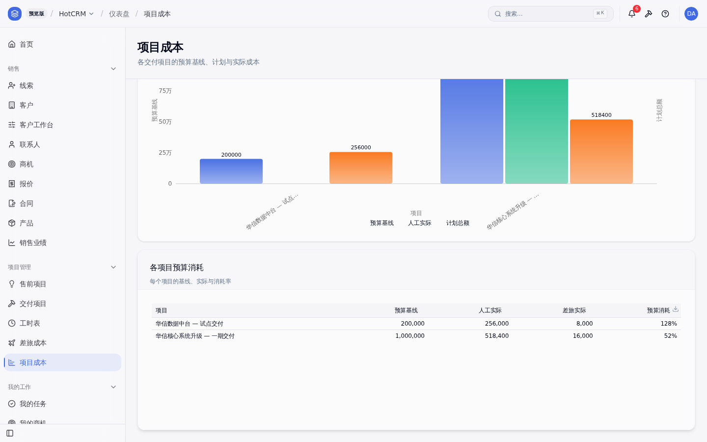
*S39b-各项目预算消耗表 — 各项目预算消耗表*

### 步骤 40 · 项目合同与订单查询

- **需求表系统路径**：`项管平台→项目报表→合同订单查询` · **状态**：未做
- **点哪里**：不点。
- **看什么 · 怎么讲**：口径：销售合同对象标准产品已有，未纳入本次路径；采购合同、订单无对象。

## 一句话收尾

> 你们的 40 步流程里，客户 / 线索 / 商机 / 审批中心 / 附件 / 跟进 / 赢丢单是现成的 CRM 能力；售前立项、交付立项、成本计划、工时与差旅、项目成本报表这 26 步，是今天新加的五个对象、六条审批流、两条门禁和一个仪表板——在同一个平台、同一套元数据里长出来的。

## 演示后复位

- 现场新建的工时表（TS-0007）、被拦截的两次尝试都不会留下脏数据；三条现场提交的记录已变为已审批 / 已立项。要回到起点：`pnpm demo:reset && pnpm dev`，再跑一次 `node scripts/demo-psa-staff.mjs`。
